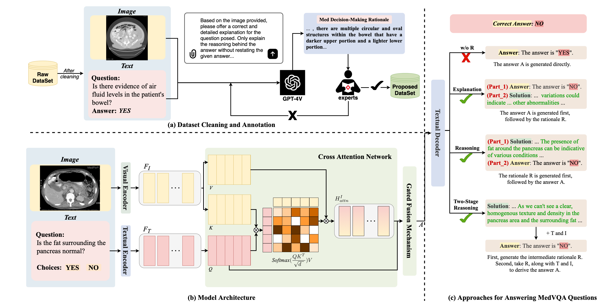

# [ 🎯 NAACL 2025 ] MedThink: A Rationale-Guided Framework for Explaining Medical Visual Question Answering

This repository contains the official implementation of our NAACL 2025 paper:

> **MedThink: A Rationale-Guided Framework for Explaining Medical Visual Question Answering**  
> Xiaotang Gai, Chenyi Zhou, Jiaxiang Liu, Yang Feng, Jian Wu, Zuozhu Liu  
> *Findings of the Association for Computational Linguistics: NAACL 2025*

[MedThink: Explaining Medical Visual Question Answering via Multimodal Decision-Making Rationale](https://aclanthology.org/2025.findings-naacl.415.pdf)



[Dataset](https://github.com/Tang-xiaoxiao/Medthink/tree/main/Medthink_Dataset): The benchmark dataset used in this project.

[Dataset_create](https://github.com/Tang-xiaoxiao/Medthink/blob/main/Medthink_Code/gemini.py): Script for constructing or generating the dataset.

[Code](https://github.com/Tang-xiaoxiao/Medthink/tree/main/Medthink_Code): Main source code of the project.

[Images_create](https://github.com/Tang-xiaoxiao/Medthink/blob/main/Medthink_Code/extract_img_feature.sh): Script for generating image features from raw images.

[Start_experiments](https://github.com/Tang-xiaoxiao/Medthink/blob/main/Medthink_Code/experiments.sh): Shell script for launching the experiments.

[Closed_end_train](https://github.com/Tang-xiaoxiao/Medthink/blob/main/Medthink_Code/closed_end_train.py): Training script for the closed-ended task setting.

[Closed_end_generate](https://github.com/Tang-xiaoxiao/Medthink/blob/main/Medthink_Code/closed_end_generate.py): Inference or generation script for the closed-ended task setting.

[Open_end_train](https://github.com/Tang-xiaoxiao/Medthink/blob/main/Medthink_Code/open_end_train.py): Training script for the open-ended task setting.

[Open_end_generate](https://github.com/Tang-xiaoxiao/Medthink/blob/main/Medthink_Code/open_end_generate.py): Inference or generation script for the open-ended task setting.

For detailed code explanations, please refer to the comments in the code.

## 📖 Citation

If you use our work, please cite:

```bibtex
@inproceedings{gai2025medthink,
  title={MedThink: A Rationale-Guided Framework for Explaining Medical Visual Question Answering},
  author={Gai, Xiaotang and Zhou, Chenyi and Liu, Jiaxiang and Feng, Yang and Wu, Jian and Liu, Zuozhu},
  booktitle={Findings of the Association for Computational Linguistics: NAACL 2025},
  pages={7438--7450},
  year={2025}
}
